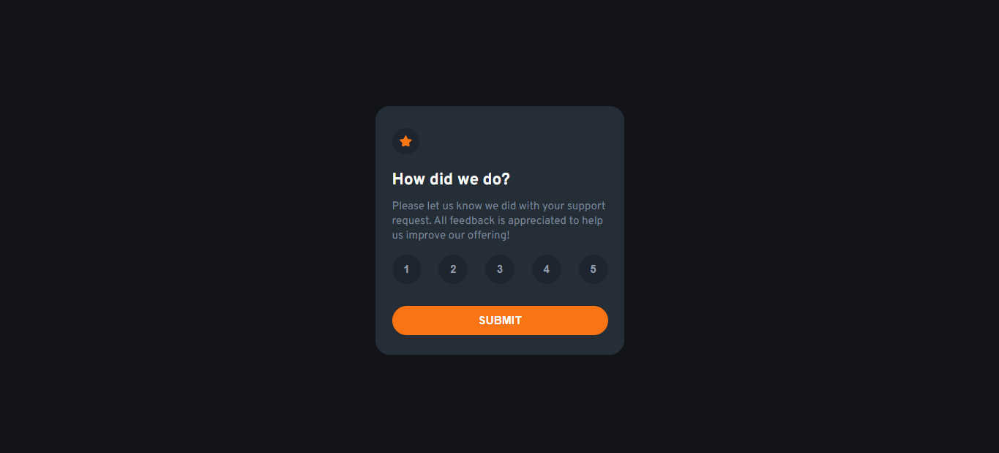
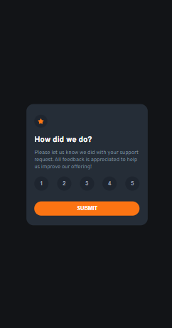

# Frontend Mentor - Interactive Rating

This is a solution to the [Interactive Rating challenge on Frontend Mentor](https://www.frontendmentor.io/challenges/interactive-rating-component-koxpeBUmI). Frontend Mentor challenges help you improve your coding skills by building realistic projects. 

## Table of contents

- [Overview](#overview)
  - [The challenge](#the-challenge)
  - [Screenshot](#screenshot)
  - [Links](#links)
- [My process](#my-process)
  - [Built with](#built-with)
  - [What I learned](#what-i-learned)
  - [Continued development](#continued-development)
- [Author](#author)
- [Acknowledgments](#acknowledgments)

## Overview

Creating an evaluation card, when the user selects a rating from 1 to 5, it will lead to another card.

### The challenge

The main focus was on user interaction with the card, more precisely JavaScript.

### Screenshot

# Desktop

# Mobile

### Links

- Live Site URL: [ => My Github <=](https://ericrdgs.github.io/Interactive-Rating/)

## My process

The html, css or JavaScript issues weren't very difficult, I used the selectors well and did it correctly.

### Built with

- Semantic HTML5 markup
- CSS custom properties
- Flexbox
- JavaScript

### What I learned

the issue of selectors evolves further.

### Continued development

I will continue to develop myself in JavaScript.

## Author

- Website - [My Github](https://github.com/EricRDGS)
- Frontend Mentor - [@EricRDGS](https://www.frontendmentor.io/profile/EricRDGS)

## Acknowledgments

I was only able to solve this challenge thanks to the double dev, through their course, the DevQuest course.

